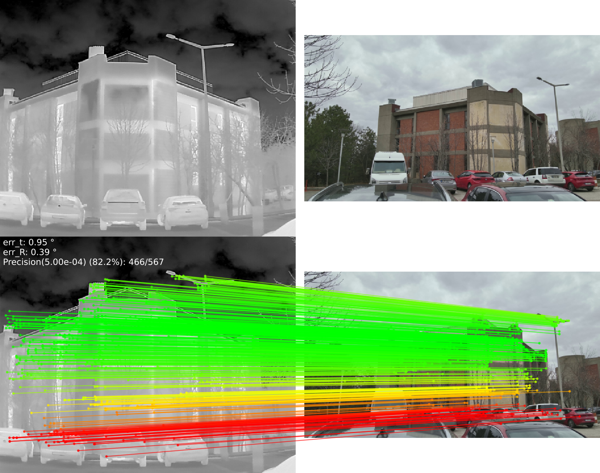
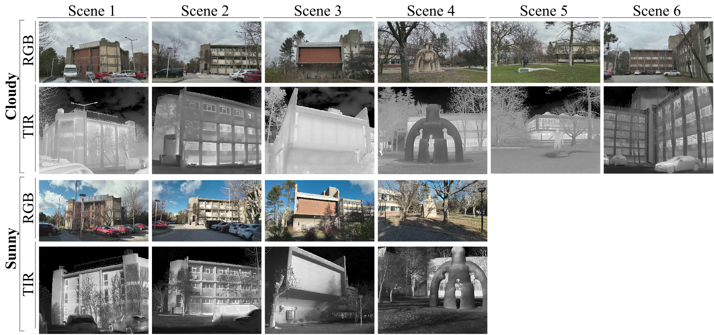

# XoFTR: Cross-modal Feature Matching Transformer
### [Paper (arXiv)](https://arxiv.org/pdf/2404.09692) | [Paper (CVF)](https://openaccess.thecvf.com/content/CVPR2024W/IMW/papers/Tuzcuoglu_XoFTR_Cross-modal_Feature_Matching_Transformer_CVPRW_2024_paper.pdf)
<br/>

This is Pytorch implementation of XoFTR: Cross-modal Feature Matching Transformer [CVPR 2024 Image Matching Workshop](https://image-matching-workshop.github.io/) paper.

XoFTR is a cross-modal cross-view method for local feature matching between thermal infrared (TIR) and visible images.

<!--  -->
<p align="center">

</p>

## Colab demo
To run XoFTR with custom image pairs without configuring your own GPU environment, you can use the Colab demo:
[](https://colab.research.google.com/drive/1T495vybejujZjJlPY-sHm8YwV5Ss86AM?usp=sharing)

## Installation
```shell
conda env create -f environment.yaml
conda activate xoftr
```
Download links for
  - [Pretrained models weights](https://drive.google.com/drive/folders/1RAI243OHuyZ4Weo1NiTy280bCE_82s4q?usp=drive_link): Two versions available, trained at 640 and 840 resolutions.
  - [METU-VisTIR dataset](https://drive.google.com/file/d/1Sj_vxj-GXvDQIMSg-ZUJR0vHBLIeDrLg/view?usp=sharing)

## METU-VisTIR Dataset
<!--  -->

<p align="center">

</p>

This dataset includes thermal and visible images captured across six diverse scenes with ground-truth camera poses. Four of the scenes encompass images captured under both cloudy and sunny conditions, while the remaining two scenes exclusively feature cloudy conditions. Since the cameras are auto-focus, there may be result in slight imperfections in the ground truth camera parameters. For more information about the dataset, please refer to our [paper](https://arxiv.org/pdf/2404.09692).

**License of the dataset:**

The METU-VisTIR dataset is licensed under the [Creative Commons Attribution-NonCommercial-ShareAlike 4.0 International License (CC BY-NC-SA 4.0)](https://creativecommons.org/licenses/by-nc-sa/4.0/deed.en).
### Data format
The dataset is organized into folders according to scenarios. The organization format is as follows:
```
METU-VisTIR/
├── index/
│     ├── scene_info_test/
│     │     ├── cloudy_cloudy_scene_1.npz   # scene info with test pairs
│     │     └── ...
│     ├── scene_info_val/
│     │     ├── cloudy_cloudy_scene_1.npz   # scene info with val pairs
│     │     └── ...
│     └── val_test_list/
│           ├── test_list.txt               # test scenes list
│           └── val_list.txt                # val scenes list
├── cloudy/                                 # cloudy scenes
│     ├── scene_1/             
│     │     ├── thermal/
│     │     │      └── images/              # thermal images
│     │     └── visible/
│     │            └── images/              # visible images 
│     └── ...
└── sunny/                                  # sunny scenes
      └── ...
```

cloudy_cloudy_scene_\*.npz and cloudy_sunny_scene_\*.npz files contain GT camera poses and image pairs

## Runing XoFTR
### Demo to match image pairs with XoFTR

A <span style="color:red">demo notebook</span> for XoFTR on a single pair of images is given in [notebooks/xoftr_demo.ipynb](notebooks/xoftr_demo.ipynb).


### Reproduce the testing results for relative pose estimation
You need to download METU-VisTIR dataset. After downloading, unzip the required files. Then, symlinks need to be created for the `data` folder.
```shell
unzip downloaded-file.zip

# set up symlinks
ln -s /path/to/METU_VisTIR/ /path/to/XoFTR/data/
```

```shell
conda activate xoftr

python test_relative_pose.py xoftr --ckpt weights/weights_xoftr_640.ckpt

# with visualization
python test_relative_pose.py xoftr --ckpt weights/weights_xoftr_640.ckpt --save_figs
```

The results and figures are saved to `results_relative_pose/`.

<br/>

## Training
See [Training XoFTR](./docs/TRAINING.md) for more details.

## Citation

If you find this code useful for your research, please use the following BibTeX entry.

```bibtex
@inproceedings{tuzcuouglu2024xoftr,
  title={XoFTR: Cross-modal Feature Matching Transformer},
  author={Tuzcuo{\u{g}}lu, {\"O}nder and K{\"o}ksal, Aybora and Sofu, Bu{\u{g}}ra and Kalkan, Sinan and Alatan, A Aydin},
  booktitle={Proceedings of the IEEE/CVF Conference on Computer Vision and Pattern Recognition},
  pages={4275--4286},
  year={2024}
}
```
## Acknowledgement
This code is derived from [LoFTR](https://github.com/zju3dv/LoFTR). We are grateful to the authors for their contribution of the source code.


